<table>
<tr>
<td valign="top"></td>
<td valign="top"></td>
</tr>
</table>

## Mani

**Python/Django Developer · Backend Systems · Workflow Automation**

Backend-focused developer building REST APIs, HRMS modules, automation workflows, and production-ready web apps with Python, Django, DRF, SQL, and JavaScript.

 

 

## Featured Work

**SpendWise - Personal Finance Tracker**  
Savings-goal allocation app with a Django REST backend, PostgreSQL database, custom admin analytics, and production deployment.  
[Live Demo](https://site--spendwise--m9lhjm5ftxzt.code.run/)

**Production HRMS Modules**  
Built attendance, leave, reporting, employee management, HR operations, asset management, and background verification modules used by company staff.

**Water Potability Prediction System**  
Machine learning classification project using Python and scikit-learn with preprocessing, model benchmarking, and evaluation reports.

**PY-Vault Banking System**  
Object-oriented Python banking engine with account creation, deposits, withdrawals, balance queries, validation, and unit-tested transaction flows.

## What I Build

- REST APIs with Django REST Framework and FastAPI
- Backend dashboards, admin workflows, and database-backed systems
- Authentication, role-based access, forms, reporting, and automation flows
- Full-stack web apps with HTML, CSS, JavaScript, SQL, and cloud deployment

## Open To

Python Backend Developer, Django Developer, Backend Developer, and Full Stack Developer roles.

Reach me: [manigururam06@gmail.com](mailto:manigururam06@gmail.com)
